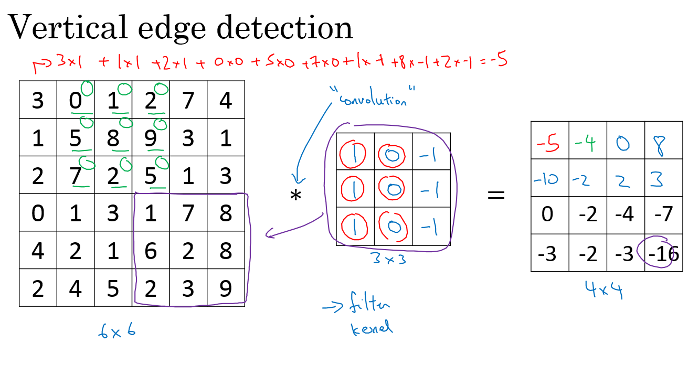

# Convolutional Neural Networks - Foundations of CNNs

## Table of contents
   * [Foundations of CNNs](#foundations-of-cnns)
      * [Computer vision](#computer-vision)
      * [Edge detection example](#edge-detection-example)
      * [Padding](#padding)
      * [Strided convolution](#strided-convolution)
      * [Convolutions over volumes](#convolutions-over-volumes)
      * [One Layer of a Convolutional Network](#one-layer-of-a-convolutional-network)
      * [A simple convolution network example](#a-simple-convolution-network-example)
      * [Pooling layers](#pooling-layers)
      * [Convolutional neural network example](#convolutional-neural-network-example)
      * [Why convolutions?](#why-convolutions)
   * [Extras](#extras)
      * [Keras](#keras)

## Foundations of CNNs

> Learn to implement the foundational layers of CNNs (pooling, convolutions) and to stack them properly in a deep network to solve multi-class image classification problems.

### Computer vision

- Examples of a computer vision problems includes:
  - Image classification.
  - Object detection.
    - Detect object and localize them.
  - Neural style transfer
    - Changes the style of an image using another image.
- One of the challenges of computer vision problem that images can be so large and we want a fast and accurate algorithm to work with that.
  - For example, a `1000x1000` image will represent 3 million feature/input to the full connected neural network. If the following hidden layer contains 1000, then we will want to learn weights of the shape `[1000, 3 million]` which is 3 billion parameter only in the first layer and thats so computationally expensive!
- One of the solutions is to build this using **convolution layers** instead of the **fully connected layers**.

### Edge detection example

- The convolution operation is one of the fundamentals blocks of a CNN. One of the examples about convolution is the image edge detection operation.
- Early layers of CNN might detect edges then the middle layers will detect parts of objects and the later layers will put the these parts together to produce an output.
- Vertical edge detection:
  - An example of convolution operation to detect vertical edges:
    - 
  - In the last example a `6x6` matrix convolved with `3x3` filter/kernel gives us a `4x4` matrix.
  - If you make the convolution operation in TensorFlow you will find the function `tf.nn.conv2d`. In keras you will find `Conv2d` function.
- Horizontal edge detection
  - Filter would be like this

    ```
    1	1	1
    0	0	0
    -1	-1	-1
    ```

- What we learned in the deep learning is that we don't need to hand craft these numbers, we can treat them as weights and then learn them. It can learn horizontal, vertical, angled, or any edge type automatically rather than getting them by hand.

### Padding

- To give it a general rule, if a matrix `nxn` is convolved with `fxf` filter/kernel give us `n-f+1,n-f+1` matrix. 
- So the problems with convolutions are:
  - Shrinks output.
  - throwing away a lot of information that are in the edges.
- If n = 6, f = 3, and p = 1 Then the output image will have `n+2p-f+1 = 6+2-3+1 = 6`. We maintain the size of the image.
- Same convolutions is a convolution with a pad so that output size is the same as the input size. Its given by the equation:

  ```
  P = (f-1) / 2
  ```
- In computer vision f is usually odd. Some of the reasons is that the filter have a center position and the padding parameter p will be even. 

### Strided convolution

- In case `(n+2p-f)/s + 1` is fraction we can take **floor** of this value.

- In math textbooks the conv operation is filpping the filter before using it. What we were doing is called cross-correlation operation but the state of art of deep learning is using this as conv operation.

  ```
  p = (n*s - n + f - s) / 2
  When s = 1 ==> P = (f-1) / 2
  ```

### Convolutions over volumes

- We will convolve an image of height, width, # of channels with a filter of a height, width, same # of channels. 
- Channels can be thought of as the number of feature the filter trying to detect:
  - Input image: `6x6x3`
  - Filter: `3x3x3`
  - Result image: `4x4x1`
  - In the last result p=0, s=1
- Hint the output here is only 2D.

- We can use multiple filters to detect multiple features or edges. Example.
  - Input image: `6x6x3`
  - 10 Filters: `3x3x3`
  - Result image: `4x4x10`
  - In the last result p=0, s=1

### One Layer of a Convolutional Network

- First we convolve some filters to a given input and then add a bias to each filter output and then get RELU of the result. Example:
  - Input image: `6x6x3`         `# a0`
  - 10 Filters: `3x3x3`         `#W1`
  - Result image: `4x4x10`     `#W1a0`
  - Add b (bias) with `10x1` will get us : `4x4x10` image      `#W1a0 + b`
  - Apply RELU will get us: `4x4x10` image                `#A1 = RELU(W1a0 + b)`
  - Hint number of parameters here are: `(3x3x3x10) + 10 = 280`
- Number of bias equals to the number of filters. 
- Hint: no matter the size of the input, the number of the parameters depends on the size of the filters.
- Here are some notations we will use. If layer l is a conv layer:

  ```
  Hyperparameters
  f[l] = filter size
  p[l] = padding	# Default is zero
  s[l] = stride
  nc[l] = number of filters

  Input:  n[l-1] x n[l-1] x nc[l-1]	Or	 nH[l-1] x nW[l-1] x nc[l-1]
  Output: n[l] x n[l] x nc[l]	Or	 nH[l] x nW[l] x nc[l]
  Where n[l] = (n[l-1] + 2p[l] - f[l] / s[l]) + 1

  Each filter is: f[l] x f[l] x nc[l-1]

  Activations: a[l] is nH[l] x nW[l] x nc[l]
  		     A[l] is m x nH[l] x nW[l] x nc[l]   # In batch or minbatch training
  		     
  Weights: f[l] * f[l] * nc[l-1] * nc[l]
  bias:  (1, 1, 1, nc[l])
  ```

### A simple convolution network example

- Lets build a big example.
  - Input Image are:   `a0 = 39x39x3`
    - `n0 = 39` and `nc0 = 3`
  - First layer (Conv layer):
    - `f1 = 3`, `s1 = 1`, and `p1 = 0`
    - `number of filters = 10`
    - Then output are `a1 = 37x37x10`
      - `n1 = 37` and `nc1 = 10`
  - Second layer (Conv layer):
    - `f2 = 5`, `s2 = 2`, `p2 = 0`
    - `number of filters = 20`
    - The output are `a2 = 17x17x20`
      - `n2 = 17`, `nc2 = 20`
    - Hint shrinking goes much faster because the stride is 2
  - Third layer (Conv layer):
    - `f3 = 5`, `s3 = 2`, `p3 = 0`
    - `number of filters = 40`
    - The output are `a3 = 7x7x40`
      - `n3 = 7`, `nc3 = 40`
  - Forth layer (Fully connected Softmax)
    - `a3 = 7x7x40 = 1960`  as a vector..
- In the last example you seen that the image are getting smaller.


### Pooling layers

- The max pooling is saying, if the feature is detected anywhere in this filter then keep a high number. But the main reason why people are using pooling because its works well in practice and reduce computations.
- Max pooling has no parameters to learn.
- Example of Max pooling on 3D input:
  - Input: `4x4x10`
  - `Max pooling size = 2` and `stride = 2`
  - Output: `2x2x10`
- The pooling is applied to each channel independently, therefore, the number of channel does not change. 
- Max pooling is used more often than average pooling in practice. In most cases, padding is not applied. p = 0.
- If stride of pooling equals the size, it will then apply the effect of shrinking.


### Convolutional neural network example

- Now we will deal with a full CNN example. This example is something like the ***LeNet-5*** that was invented by Yann Lecun.
  - Input Image are:   `a0 = 32x32x3`
  - First layer (Conv layer):        `#Conv1`
    - `f1 = 5`, `s1 = 1`, and `p1 = 0`
    - `number of filters = 6`
    - Then output are `a1 = 28x28x6`
      - `n1 = 28` and `nc1 = 6`
    - Then apply (Max pooling):         `#Pool1`
      - `f1p = 2`, and `s1p = 2`
      - The output are `a1 = 14x14x6`
  - Second layer (Conv layer):   `#Conv2`
    - `f2 = 5`, `s2 = 1`, `p2 = 0`
    - `number of filters = 16`
    - The output are `a2 = 10x10x16`
      - `n2 = 10`, `nc2 = 16`
    - Then apply (Max pooling):         `#Pool2`
      - `f2p = 2`, and `s2p = 2`
      - The output are `a2 = 5x5x16`
  - Third layer (Fully connected)   `#FC3`
    - Number of neurons are 120
    - The output `a3 = 120 x 1` . 400 came from `5x5x16`
  - Forth layer (Fully connected)  `#FC4`
    - Number of neurons are 84
    - The output `a4 = 84 x 1` .
  - Fifth layer (Softmax)
    - Number of neurons is 10 if we need to identify for example the 10 digits.
- Some statistics about the last example:
  - 
  
```
Here are the 5 typos:

1. 208 should be (5*5*3 + 1) * 8 = 608
2. 416 should be (5*5*8 + 1) * 16 = 3216
3. In the FC3, 48001 should be 400*120 + 120 = 48120, since the bias should have 120 parameters, not 1
4. Similarly, in the FC4, 10081 should be 120*84 + 84 (not 1) = 10164
(Here, the bias is for the fully connected layer. In fully connected layers, there will be one bias for each neuron, so the bias become In FC3 there were 120 neurons so 120 biases.)
5. Finally, in the softmax, 841 should be 84*10 + 10 = 850
```  

- The majority number of parameter is from the FC layers. 
- Usually the input size decreases over layers while the number of filters increases.

### Why convolutions?

- Two main advantages of Convs are， also the reason why convolution could have smaller numbers of parameters. 
  - Parameter sharing.
    - A feature detector (such as a vertical edge detector) that's useful in one part of the image is probably useful in another part of the image.
  - Sparsity of connections.
    - In each layer, each output value depends only on a small number of inputs which is intuitive for image. 
  - Translation invariance: even shift the image, the convolution result remain similar to the original image. 
- Putting it all together:
  - 


## Extras

### Keras

- Keras is a high-level neural networks API (programming framework), written in Python and capable of running on top of several lower-level frameworks including TensorFlow, Theano, and CNTK.
- Keras was developed to enable deep learning engineers to build and experiment with different models very quickly.
- Just as TensorFlow is a higher-level framework than Python, Keras is an even higher-level framework and provides additional abstractions.
- Keras will work fine for many common models.
- Layers in Keras:
  - Dense (Fully connected layers).
    - A linear function followed by a non linear function.
  - Convolutional layer.
  - Pooling layer.
  - Normalisation layer.
    - A batch normalization layer.
  - Flatten layer
    - Flatten a matrix into vector.
  - Activation layer
    - Different activations include: relu, tanh, sigmoid, and softmax.
- To train and test a model in Keras there are four steps:
  1. Create the model.
  2. Compile the model by calling `model.compile(optimizer = "...", loss = "...", metrics = ["accuracy"])`
  3. Train the model on train data by calling `model.fit(x = ..., y = ..., epochs = ..., batch_size = ...)`
     - You can add a validation set while training too.
  4. Test the model on test data by calling `model.evaluate(x = ..., y = ...)`
- Summarize of step in Keras: Create->Compile->Fit/Train->Evaluate/Test
- `Model.summary()` gives a lot of useful informations regarding your model including each layers inputs, outputs, and number of parameters at each layer.
- To choose the Keras backend you should go to `$HOME/.keras/keras.json` and change the file to the desired backend like Theano or Tensorflow or whatever backend you want.
- After you create the model you can run it in a tensorflow session without compiling, training, and testing capabilities.
- You can save your model with `model_save` and load your model using `model_load ` This will save your whole trained model to disk with the trained weights.


<br><br>
<br><br>
These Notes were made by [Yuxiang ZHANG](mailto:kimiyuxiang@gmail.com) @2020

