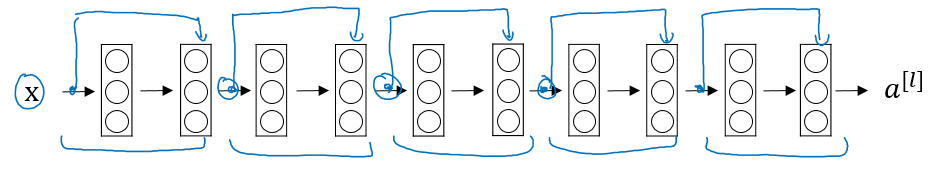

# Convolutional Neural Networks

This is the fourth course of the deep learning specialization at [Coursera](https://www.coursera.org/specializations/deep-learning) which is moderated by [DeepLearning.ai](http://deeplearning.ai/). The course is taught by Andrew Ng.

## Table of contents
   * [Deep convolutional models: case studies](#deep-convolutional-models-case-studies)
      * [Why look at case studies?](#why-look-at-case-studies)
      * [Classic networks](#classic-networks)
      * [Residual Networks (ResNets)](#residual-networks-resnets)
      * [Why ResNets work](#why-resnets-work)
      * [Network in Network and 1×1 convolutions](#network-in-network-and-1-X-1-convolutions)
      * [Inception network motivation](#inception-network-motivation)
      * [Inception network (GoogleNet)](#inception-network-googlenet)
      * [Using Open-Source Implementation](#using-open-source-implementation)
      * [Transfer Learning](#transfer-learning)
      * [Data Augmentation](#data-augmentation)
      * [State of Computer Vision](#state-of-computer-vision)

## Deep convolutional models: case studies

> Learn about the practical tricks and methods used in deep CNNs straight from the research papers.

### Why look at case studies?

- Here are some classical CNN networks:
  - **LeNet-5**
  - **AlexNet**
  - **VGG**
- The best CNN architecture that won the last ImageNet competition is called **ResNet** and it has 152 layers!
- There are also an architecture called **Inception** that was made by Google that are very useful to learn and apply to your tasks.

### Classic networks

- In this section we will talk about classic networks which are **LeNet-5**, **AlexNet**, and **VGG**.

- **LeNet-5**

  - The goal for this model was to identify handwritten digits in a `32x32x1` gray image. 
  - The dimensions of the image decreases as the number of channels increases.
  - `Conv ==> Pool ==> Conv ==> Pool ==> FC ==> FC ==> softmax` this type of arrangement is quite common.
  - The activation function used in the paper was Sigmoid and Tanh. Modern implementation uses RELU in most of the cases.

- **AlexNet**

  - The goal for the model was the ImageNet challenge which classifies images into 1000 classes. Here are the drawing of the model:
  - 
  - Summary:

    - ```
      Conv => Max-pool => Conv => Max-pool => Conv => Conv => Conv => Max-pool ==> Flatten ==> FC ==> FC ==> Softmax
      ```
  - Similar to LeNet-5 but bigger: 60 Million parameter compared to 60k parameter of LeNet-5.
  - It used the RELU activation function.
  - The original paper contains Multiple GPUs and Local Response normalization which doesn't help much.
  - This paper convinced the computer vision researchers that deep learning is so important.

- **VGG-16**
  - 16 because there are 16 layers with weights. 
  - Focus on having only these blocks:
    - CONV = 3 X 3 filter, s = 1, same  
    - MAX-POOL = 2 X 2 , s = 2
  - Here are the architecture:
    - 
  - This network is large even by modern standards. It has around 138 million parameters.
    - Most of the parameters are in the fully connected layers.
  - Number of filters increases from 64 to 128 to 256 to 512. 512 was made twice.
  - There are another version called **VGG-19** which is a bigger version. But most people uses the VGG-16 instead of the VGG-19 because it does the same.
 
### Residual Networks (ResNets)

- Very, very deep NNs are difficult to train because of vanishing and exploding gradients problems.
- **Residual block**
  - ResNets are built out of some Residual blocks.
  - 
  - $a^[l]$ is added to `z^[l+2]` then take the activation together.
- **Residual Network**
  - Are a NN that consists of some Residual blocks.
  - 
  - These networks can go deeper without hurting the performance, due to vanishing and exploding gradients. 
  - 
  - On the left is the normal NN and on the right are the ResNet. As you can see the performance of ResNet increases as the network goes deeper.

### Why ResNets work

- Lets see some example that illustrates why resNet work.
  - Suppose we are using RELU activations.

  - Then:
    - `a[l+2] = g( z[l+2] + a[l] ) = g( W[l+2] a[l+1] + b[l+2] + a[l] ) `
      
  - Then if we are using L2 regularization for example, `W[l+2]` will be zero. Lets say that `b[l+2]` will be zero too.
  - Then `a[l+2] = g( a[l] ) = a[l]` with no negative values.

  - This show that identity function is easy for a residual block to learn. 
  - Adding the two layers doesn't hurt the performance to do as well as the simpler NN. 
  - Using a skip-connection helps the gradient to backpropagate and thus helps you to train deeper networks

  - Hint: dimensions of z[l+2] and a[l] have to be the same in resNets. In case they have different dimensions what we put a matrix parameters (Which can be learned or fixed)
    - `a[l+2] = g( z[l+2] + ws * a[l] ) # The added Ws should make the dimensions equal`
    - ws also can be a zero padding.

- Lets take a look at ResNet on images.

  - Here are the architecture of **ResNet-34**:
  - 
  - No FC layers, No dropout is used.
  - Two main types of blocks are used in a ResNet, depending mainly on whether the input/output dimensions are same or different.
  - The dotted lines is the case when the dimensions are different. To solve then they down-sample the input by 2 and then pad zeros to match the two dimensions. 
  
- Useful concept (**Spectrum of Depth**):

  - 
  - Taken from [icml.cc/2016/tutorials/icml2016_tutorial_deep_residual_networks_kaiminghe.pdf](icml.cc/2016/tutorials/icml2016_tutorial_deep_residual_networks_kaiminghe.pdf)

- Residual blocks types:

  - Identity block:
    - 
    - Hint the conv is followed by a batch norm `BN` before `RELU`. Dimensions here are same.
    - This skip is over 2 layers. The skip connection can jump n connections where n>2
    - This drawing represents [Keras](https://keras.io/) layers.
  - The convolutional block:
    - 
    - The conv can be bottleneck 1 x 1 conv

### Network in Network and 1 X 1 convolutions

- A 1 x 1 convolution  - We also call it Network in Network. 

- What does a 1 X 1 convolution do? Isn't it just multiplying by a number?

  - Example:
    - Input: `6x6x32`
    - Conv: `1x1x32` 5 filters.     `# The 1 x 1 Conv`
    - Output: `6x6x5`
	- Apply NN to each 6x6 pixels, which performs non-trivial operations by adding non-linearity to the NN. 
	- By default, 1 x 1 convolution does not need padding to keep the shape unchanged. 

- A 1 x 1 convolution is useful when:

  - We want to shrink the number of channels. We also call this feature transformation.
  - We will later see that by shrinking it we can save a lot of computations.
  - If we have specified the number of 1 x 1 Conv filters to be the same as the input number of channels then the output will contain the same number of channels. Then the 1 x 1 Conv will act like a non linearity and will learn non linearity operator. 

- Replace fully connected layers with 1 x 1 convolutions as Yann LeCun believes they are the same.
  - > In Convolutional Nets, there is no such thing as "fully-connected layers". There are only convolution layers with 1x1 convolution kernels and a full connection table. [Yann LeCun](https://www.facebook.com/yann.lecun/posts/10152820758292143) 


### Inception network motivation
- When you design a CNN you have to decide all the layers yourself. Will you pick a 3 x 3 Conv or 5 x 5 Conv or maybe a max pooling layer. 
- What **inception** tells us is, Why not use all of them at once?

- **Inception module**, naive version:
  - 
  - Input to the inception module are 28 x 28 x 192 and the output are 28 x 28 x 256
  - For maxpooling layers, it is a bit usual, since there is padding and stride = 1. 

- The problem of computational cost in Inception model:
- Using 1 X 1 convolution to reduce computational cost:
  - The new architecture are:
    - X0 shape is (28, 28, 192)
    - We then apply 16 (1 x 1 Convolution)
    - That produces X1 of shape (28, 28, 16)
      - Hint, we have reduced the dimensions here.
    - Then apply 32  (5 x 5 Convolution)
    - That produces X2 of shape (28, 28, 32)
  
- A 1 x 1 Conv here is called Bottleneck `BN`.
- It turns out that the 1 x 1 Conv won't hurt the performance.
- **Inception module**, dimensions reduction version:
  - 
- Example of inception model in Keras:
  - 

### Inception network (GoogleNet)

- The inception network consist of concatenated blocks of the Inception module.
- Here are the full model:
  - 
- Some times a Max-Pool block is used before the inception module to reduce the dimensions of the inputs.
- There are a 3 Sofmax branches at different positions to push the network toward its goal. 
- The intermediate features are good enough to the network to learn and it turns out that softmax0 and sofmax1 gives regularization effect.

### Using Open-Source Implementation

- It turns out that a lot of these NN are difficult to replicated. because there are some details that may not presented on its papers.
  - Learning decay.
  - Parameter tuning.
  
- If you see a research paper and you want to build over it, the first thing you should do is to look for an open source implementation for this paper.

### Transfer Learning
  - One of the tricks that can speed up your training, is to run the pretrained NN without final softmax layer and get an intermediate representation of your images and save them to disk. And then use these representation to a shallow NN network. This can save you the time needed to run an image through all the layers.
    - Its like converting your images into vectors. 
- Another example:
  - If you have enough data, you can fine tune all the layers in your pretrained network but don't random initialize the parameters, leave the learned parameters as it is and learn from there. 

### Data Augmentation

- Some data augmentation methods that are used for computer vision tasks includes:
  - Mirroring.
  - Random cropping.
    - The issue with this technique is that you might take a wrong crop.
    - The solution is to make your crops big enough.
  - Rotation.
  - Shearing.
  - Local warping.
  - Color shifting.

- Data Augmentation has also some hyperparameters. A good place to start is to find an open source data augmentation implementation and then use it or fine tune these hyperparameters.

### State of Computer Vision

- If your problem has a large amount of data, researchers are tend to use:
  - Simpler algorithms.
  - Less hand engineering.

- We will see in the next chapter that because the object detection has less data, a more complex NN architectures will be presented.

- Tips for doing well on benchmarks/winning competitions:
  - Ensembling.
    - Train several networks independently and average their outputs. 
  - Multi-crop at test time.
    - Run classifier on multiple versions of test versions and average results.
    - There is a technique called 10 crops that uses this.
- Use open source code
  - Use architectures of networks published in the literature.
  - Use pretrained models and fine-tune on your dataset.

<br><br>
These Notes were made by [Yuxiang ZHANG](mailto:kimiyuxiang@gmail.com) @2020

