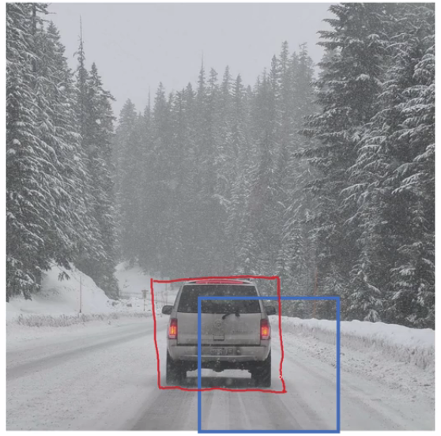
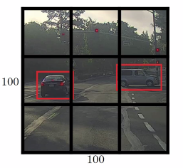
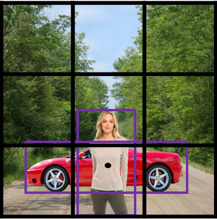
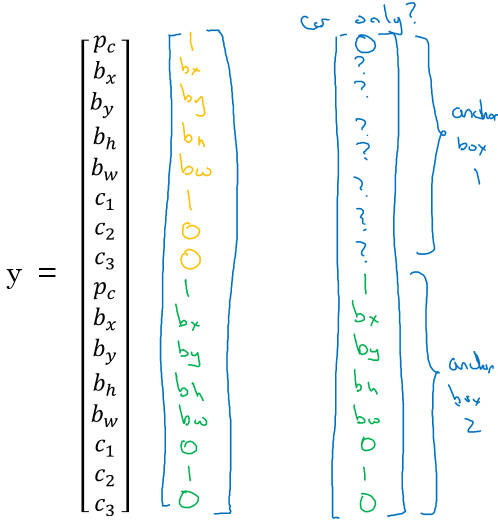

# Convolutional Neural Networks

   * [Table of contents](#table-of-contents)
   * [Object detection](#object-detection)
      * [Object Localization](#object-localization)
      * [Landmark Detection](#landmark-detection)
      * [Object Detection](#object-detection-1)
      * [Convolutional Implementation of Sliding Windows](#convolutional-implementation-of-sliding-windows)
      * [Bounding Box Predictions](#bounding-box-predictions)
      * [Intersection Over Union](#intersection-over-union)
      * [Non-max Suppression](#non-max-suppression)
      * [Anchor Boxes](#anchor-boxes)
      * [YOLO Algorithm](#yolo-algorithm)
      * [Region Proposals (R-CNN)](#region-proposals-r-cnn)


## Object detection

> Learn how to apply your knowledge of CNNs to one of the toughest but hottest field of computer vision: Object detection.

### Object Localization
Going from image classification to localization and finally object detection. 
- What are localization and detection?

  - **Image Classification**: 
    - Classify an image to a specific class. 
    - 
  - **Classification with localization**:
    - Given an image we want to learn the class of the image and where are the class location in the image. 
    - 
  - **Object detection**:
    - Given an image we want to detect all the object in the image that belong to a specific classes and give their location. 
    - 
  - **Semantic Segmentation**:
    - We want to Label each pixel in the image with a category label. Semantic Segmentation Don't differentiate instances, only care about pixels. It detects no objects just pixels.
    - If there are two objects of the same class is intersected, we won't be able to separate them.
    - 
  - **Instance Segmentation**
    - This is like the full problem. Rather than we want to predict the bounding box, we want to know which pixel label but also distinguish them.
    - 

- To make image classification we use a Conv Net with a Softmax attached to the end of it.
- To make classification with localization we use a Conv Net with a softmax attached to the end of it and a four numbers `bx`, `by`, `bh`, and `bw` to tell you the location of the class in the image.

- Defining the target label Y in classification with localization problem: 

  - ```
    Y = [
      		Pc				# Probability of an object is presented
      		bx				# Bounding box
      		by				# Bounding box
      		bh				# Bounding box
      		bw				# Bounding box
      		c1				# The classes
      		c2
      		...
    ]
    ```

- The loss function for the Y we have created (Example of the square error):

  -     L(y',y) = { (y1'-y1)^2 + (y2'-y2)^2 + ...   if y1 = 1, 
  	(y1'-y1)^2			     	    if y1 = 0  }
    
  - In practice we use logistic regression for `pc`, log likely hood loss for classes, and squared error for the bounding box.


### Landmark Detection

- In some of the computer vision problems you will need to output some points. That is called **landmark detection**.

- For example, if you are working in a face recognition problem you might want some points on the face like corners of the eyes, corners of the mouth, and corners of the nose and so on. 
- This can help in a lot of application like detecting the emotion or the gesture of a person based on these landmarks.

- The key here is to define Label Y. 

  - ```
    Y = [
      		THereIsAface				# Probability of face is presented 0 or 1
      		l1x,
      		l1y,
      		....,
      		l64x,
      		l64y
    ]
    ```

### Object Detection

- The first thing, we will train a Conv net on cropped car images and non car images.
  - The ratio between positive and negative example could be 1:3.
  - Before training a classifier, we need to re-size each training example. 
  - 

- Inference: after we finish training of this Conv net we will then use it with the sliding windows technique.

- Sliding windows detection algorithm:
  1. Decide a rectangle size.
  2. Split your image into rectangles of the size you picked. For each rectangle feed the image into the Conv net and decide if its a car or not.
  3. Pick larger/smaller rectangles and repeat the process 2.
  4. Store the rectangles that contains the cars.
  5. If two or more rectangles intersects choose the rectangle with the best accuracy.

- Disadvantage of sliding window is the computation time.
	- To solve this problem, we can implement the sliding windows with a ***Convolutional approach***.
	- One other idea is to compress your deep learning model.

### Convolutional Implementation of Sliding Windows

- Turning FC layer into convolutional layers (predict image class from four classes):
  - 
  
- **Convolution implementation of sliding windows**:
  - First lets consider that the Conv net you trained is like this (No FC all is conv layers):
    - 
  - Sliding window: for each cropped image, we run them through the trained network independently to generate the labels. 
  - The convolution implementation will be as follows:
    - 
  - Simply we have feed the entire image into the same Conv net we have trained.
  - **Due to the 'focusing effect' of convolution, each pixel in the final matrix corresponds to the classification result for each sliding window.**
  - **Add extra classification window to make classifications for different sliding window size.**
  
  - Another example would be:
    - 
  - This example has a total of 16 sliding windows that shares the computation together.
  - [[Sermanet et al., 2014, OverFeat: Integrated recognition, localization and detection using convolutional networks]](https://arxiv.org/abs/1312.6229)

- The difference between localization and classification is that the former one also fit for the bounding boxes.
  - 
  - In red, the rectangle we want and in blue is the required car rectangle.

### Bounding Box Predictions

- Yolo Algorithm is applying localization algorithm to each of the grid. 

  - 

  1. Lets say we have an image of 100 X 100. Place a  3 x 3 grid on the image. 
  2. For more smoother results you should use 19 x 19 for the 100 x 100, which will also reduce the chance of having multiple target in the same window. 
  3. Apply the classification and localization algorithm we discussed in a previous section to each section of the grid. 
  4. Do everything at once with the convolution sliding window.  3x3x8 is the final output. 
  5. Merging the results using predicted localization mid point.

**Problems and Summary**
- We have a problem if we have found more than one object in one grid box.
- There is no need for designing model architecture for different sliding window size, since Yolo predefine the grid partitioning. 
- Each pixels in the final output corresponds to a grid in the original image. 

- How is YOLO different from other Object detectors?  YOLO uses a single CNN
  network for both classification and localizing the object using bounding boxes.

### Intersection Over Union

- Intersection Over Union is a function used to evaluate the object detection algorithm.
- *IoU* *is a measure of the overlap between two bounding boxes*.
- If `IOU >=0.5` then its good. The best answer will be 1.
- The higher the IOU the better is the accuracy.

### Non-max Suppression

- One of the problems we have addressed in YOLO is that it can detect an object multiple times.
- Non-max Suppression is a way to make sure that YOLO detects the object just once.
- Non-max suppression algorithm:
  1. Lets assume that we are targeting one class as an output class.
  2. Y shape should be `[Pc, bx, by, bh, hw]` Where Pc is the probability if that object occurs.
  3. Discard all boxes with `Pc < 0.6`  
  4. While there are any remaining boxes:
     1. Pick the box with the largest Pc Output that as a prediction.
     2. Discard any remaining box with `IoU > 0.5` with that box output in the previous step i.e any box with high overlap(greater than overlap threshold of 0.5).
- If there are multiple classes/object types `c` you want to detect, you should run the Non-max suppression `c` times, once for every output class.

### Anchor Boxes: Predict multiple bounding boxes for each grid. 
- The size of the anchor boxes is latent which could be learnt. Similar with faster R-CNN, adding classification header to detect multiple bounding boxes shape. 

- In YOLO, a grid only detects one object. What if a grid cell wants to detect multiple object?
  - 
  - Car and person grid is same here.
  - Y = `[Pc, bx, by, bh, bw, c1, c2, c3, Pc, bx, by, bh, bw, c1, c2, c3]`  We simply have repeated  the one anchor Y.
  - The two anchor boxes you choose should be known as a shape:
    - 
- So Previously, each object in training image is assigned to grid cell that contains that object's midpoint.
- With two anchor boxes, Each object in training image is assigned to grid cell that contains object's midpoint and anchor box for the grid cell with <u>highest IoU</u>. 
- Example of data:
  - 
  - Where the car was near the anchor 2 than anchor 1.
- You may have two or more anchor boxes but you should know their shapes.
  - how do you choose the anchor boxes and people used to just choose them by hand. Maybe five or ten anchor box shapes that spans a variety  of shapes that cover the types of objects you seem to detect frequently.
  - You may also use a k-means algorithm on your dataset to specify that.
- Anchor boxes allows your algorithm to specialize, means in our case to easily detect wider images or taller ones.

### YOLO Algorithm

- Lets sum up and introduce the whole YOLO algorithm given an example.
- Suppose we need to do object detection for our autonomous driver system.It needs to identify three classes:

  1. Pedestrian (Walks on ground).
  2. Car.
  3. Motorcycle.

- We decided to choose two anchor boxes, a taller one and a wide one.

  - Like we said in practice they use five or more anchor boxes hand made or generated using k-means.

- Our labeled Y shape will be `[HeightOfGrid, WidthOfGrid, 16]`

  - `[Pc, bx, by, bh, bw, c1, c2, c3, Pc, bx, by, bh, bw, c1, c2, c3]`

- Your dataset could be an image with a multiple labels and a rectangle for each label.

  - An example:
    - 
  - We first initialize all of them to zeros and ?.
  - Then for each label and rectangle choose its closest grid point then the shape to fill it 
  - Then the best anchor point based on the IOU. so that the shape of Y for one image should be `[HeightOfGrid, WidthOfGrid,16]`

- Train the labeled images on a Conv net. you should receive an output of `[HeightOfGrid, WidthOfGrid,16]` for our case.

- To make predictions, run the Conv net on an image and run Non-max suppression algorithm for each class you have in our case there are 3 classes.

  - You could get something like that:
    - 
    - Total number of generated boxes are grid_width * grid_height * no_of_anchors = 3 x 3 x 2
  - By removing the low probability predictions you should have:
    - 
  - Then get the best probability followed by the IOU filtering:
    - 

- [YOLO9000 Better, faster, stronger](https://arxiv.org/abs/1612.08242)

**Summary:**
  - Each pixel in the final output corresponds to a grid in the raw image. This can be thought as the convolutional implementation of the sliding window. 
  - In fast R-CNN, adding classification header on the ROIPooling CNN is similar to predicting multiple bounding boxes with different shapes. 
  - ```
    ________________________________________________________________________________________
    Layer (type)                     Output Shape          Param #     Connected to                
    ========================================================================================
    input_1 (InputLayer)             (None, 608, 608, 3)   0                                 
    ________________________________________________________________________________________
    conv2d_1 (Conv2D)                (None, 608, 608, 32)  864         input_1[0][0]         
    ________________________________________________________________________________________
    batch_normalization_1 (BatchNorm (None, 608, 608, 32)  128         conv2d_1[0][0]       
    ________________________________________________________________________________________
    leaky_re_lu_1 (LeakyReLU)        (None, 608, 608, 32)  0     batch_normalization_1[0][0] 
    ________________________________________________________________________________________
    max_pooling2d_1 (MaxPooling2D)   (None, 304, 304, 32)  0           leaky_re_lu_1[0][0]   
    ________________________________________________________________________________________
    conv2d_2 (Conv2D)                (None, 304, 304, 64)  18432       max_pooling2d_1[0][0] 
    ________________________________________________________________________________________
    batch_normalization_2 (BatchNorm (None, 304, 304, 64)  256         conv2d_2[0][0]       
    ________________________________________________________________________________________
    leaky_re_lu_2 (LeakyReLU)        (None, 304, 304, 64)  0     batch_normalization_2[0][0] 
    _______________________________________________________________________________________
    max_pooling2d_2 (MaxPooling2D)   (None, 152, 152, 64)  0           leaky_re_lu_2[0][0]   
    ________________________________________________________________________________________
    conv2d_3 (Conv2D)                (None, 152, 152, 128) 73728       max_pooling2d_2[0][0] 
    ________________________________________________________________________________________
    batch_normalization_3 (BatchNorm (None, 152, 152, 128) 512         conv2d_3[0][0]       
    ________________________________________________________________________________________
    leaky_re_lu_3 (LeakyReLU)        (None, 152, 152, 128) 0     batch_normalization_3[0][0] 
    ________________________________________________________________________________________
    conv2d_4 (Conv2D)                (None, 152, 152, 64)  8192        leaky_re_lu_3[0][0]   
    ________________________________________________________________________________________
    batch_normalization_4 (BatchNorm (None, 152, 152, 64)  256         conv2d_4[0][0]       
    ________________________________________________________________________________________
    leaky_re_lu_4 (LeakyReLU)        (None, 152, 152, 64)  0     batch_normalization_4[0][0] 
    ________________________________________________________________________________________
    conv2d_5 (Conv2D)                (None, 152, 152, 128) 73728       leaky_re_lu_4[0][0]   
    ________________________________________________________________________________________
    batch_normalization_5 (BatchNorm (None, 152, 152, 128) 512         conv2d_5[0][0]       
    ________________________________________________________________________________________
    leaky_re_lu_5 (LeakyReLU)        (None, 152, 152, 128) 0     batch_normalization_5[0][0] 
    ________________________________________________________________________________________
    max_pooling2d_3 (MaxPooling2D)   (None, 76, 76, 128)   0           leaky_re_lu_5[0][0]   
    ________________________________________________________________________________________
    conv2d_6 (Conv2D)                (None, 76, 76, 256)   294912      max_pooling2d_3[0][0] 
    _______________________________________________________________________________________
    batch_normalization_6 (BatchNorm (None, 76, 76, 256)   1024        conv2d_6[0][0]       
    ________________________________________________________________________________________
    leaky_re_lu_6 (LeakyReLU)        (None, 76, 76, 256)   0     batch_normalization_6[0][0] 
    _______________________________________________________________________________________
    conv2d_7 (Conv2D)                (None, 76, 76, 128)   32768       leaky_re_lu_6[0][0]   
    ________________________________________________________________________________________
    batch_normalization_7 (BatchNorm (None, 76, 76, 128)   512         conv2d_7[0][0]       
    _______________________________________________________________________________________
    leaky_re_lu_7 (LeakyReLU)        (None, 76, 76, 128)   0     batch_normalization_7[0][0] 
    ________________________________________________________________________________________
    conv2d_8 (Conv2D)                (None, 76, 76, 256)   294912      leaky_re_lu_7[0][0]   
    ________________________________________________________________________________________
    batch_normalization_8 (BatchNorm (None, 76, 76, 256)   1024        conv2d_8[0][0]       
    ________________________________________________________________________________________
    leaky_re_lu_8 (LeakyReLU)        (None, 76, 76, 256)   0     batch_normalization_8[0][0] 
    ________________________________________________________________________________________
    max_pooling2d_4 (MaxPooling2D)   (None, 38, 38, 256)   0           leaky_re_lu_8[0][0]   
    ________________________________________________________________________________________
    conv2d_9 (Conv2D)                (None, 38, 38, 512)   1179648     max_pooling2d_4[0][0] 
    ________________________________________________________________________________________
    batch_normalization_9 (BatchNorm (None, 38, 38, 512)   2048        conv2d_9[0][0]       
    ________________________________________________________________________________________
    leaky_re_lu_9 (LeakyReLU)        (None, 38, 38, 512)   0     batch_normalization_9[0][0] 
    ________________________________________________________________________________________
    conv2d_10 (Conv2D)               (None, 38, 38, 256)   131072      leaky_re_lu_9[0][0]   
    ________________________________________________________________________________________
    batch_normalization_10 (BatchNor (None, 38, 38, 256)   1024        conv2d_10[0][0]       
    ________________________________________________________________________________________
    leaky_re_lu_10 (LeakyReLU)       (None, 38, 38, 256)   0    batch_normalization_10[0][0]
    ________________________________________________________________________________________
    conv2d_11 (Conv2D)               (None, 38, 38, 512)   1179648    leaky_re_lu_10[0][0]   
    ________________________________________________________________________________________
    batch_normalization_11 (BatchNor (None, 38, 38, 512)   2048        conv2d_11[0][0]       
    ________________________________________________________________________________________
    leaky_re_lu_11 (LeakyReLU)       (None, 38, 38, 512)   0    batch_normalization_11[0][0]
    _______________________________________________________________________________________
    conv2d_12 (Conv2D)               (None, 38, 38, 256)   131072      leaky_re_lu_11[0][0] 
    ________________________________________________________________________________________
    batch_normalization_12 (BatchNor (None, 38, 38, 256)   1024        conv2d_12[0][0]       
    ________________________________________________________________________________________
    leaky_re_lu_12 (LeakyReLU)       (None, 38, 38, 256)   0   batch_normalization_12[0][0]
    ________________________________________________________________________________________
    conv2d_13 (Conv2D)               (None, 38, 38, 512)   1179648     leaky_re_lu_12[0][0] 
    ________________________________________________________________________________________
    batch_normalization_13 (BatchNor (None, 38, 38, 512)   2048        conv2d_13[0][0]       
    ________________________________________________________________________________________
    leaky_re_lu_13 (LeakyReLU)       (None, 38, 38, 512)   0    batch_normalization_13[0][0]
    ________________________________________________________________________________________
    max_pooling2d_5 (MaxPooling2D)   (None, 19, 19, 512)   0           leaky_re_lu_13[0][0] 
    _______________________________________________________________________________________
    conv2d_14 (Conv2D)               (None, 19, 19, 1024)  4718592     max_pooling2d_5[0][0] 
    ________________________________________________________________________________________
    batch_normalization_14 (BatchNor (None, 19, 19, 1024)  4096        conv2d_14[0][0]       
    ________________________________________________________________________________________
    leaky_re_lu_14 (LeakyReLU)       (None, 19, 19, 1024)  0    batch_normalization_14[0][0]
    ________________________________________________________________________________________
    conv2d_15 (Conv2D)               (None, 19, 19, 512)   524288      leaky_re_lu_14[0][0] 
    ________________________________________________________________________________________
    batch_normalization_15 (BatchNor (None, 19, 19, 512)   2048        conv2d_15[0][0]       
    ________________________________________________________________________________________
    leaky_re_lu_15 (LeakyReLU)       (None, 19, 19, 512)   0    batch_normalization_15[0][0]
    ________________________________________________________________________________________
    conv2d_16 (Conv2D)               (None, 19, 19, 1024)  4718592     leaky_re_lu_15[0][0] 
    ________________________________________________________________________________________
    batch_normalization_16 (BatchNor (None, 19, 19, 1024)  4096        conv2d_16[0][0]       
    ________________________________________________________________________________________
    leaky_re_lu_16 (LeakyReLU)       (None, 19, 19, 1024)  0    batch_normalization_16[0][0]
    ________________________________________________________________________________________
    conv2d_17 (Conv2D)               (None, 19, 19, 512)   524288      leaky_re_lu_16[0][0] 
    ________________________________________________________________________________________
    batch_normalization_17 (BatchNor (None, 19, 19, 512)   2048        conv2d_17[0][0]       
    ________________________________________________________________________________________
    leaky_re_lu_17 (LeakyReLU)       (None, 19, 19, 512)   0    batch_normalization_17[0][0]
    _______________________________________________________________________________________
    conv2d_18 (Conv2D)               (None, 19, 19, 1024)  4718592     leaky_re_lu_17[0][0] 
    ________________________________________________________________________________________
    batch_normalization_18 (BatchNor (None, 19, 19, 1024)  4096        conv2d_18[0][0]       
    ________________________________________________________________________________________
    leaky_re_lu_18 (LeakyReLU)       (None, 19, 19, 1024)  0    batch_normalization_18[0][0]
    ________________________________________________________________________________________
    conv2d_19 (Conv2D)               (None, 19, 19, 1024)  9437184     leaky_re_lu_18[0][0] 
    ________________________________________________________________________________________
    batch_normalization_19 (BatchNor (None, 19, 19, 1024)  4096        conv2d_19[0][0]       
    ________________________________________________________________________________________
    conv2d_21 (Conv2D)               (None, 38, 38, 64)    32768       leaky_re_lu_13[0][0]
    ________________________________________________________________________________________
    leaky_re_lu_19 (LeakyReLU)       (None, 19, 19, 1024)  0    batch_normalization_19[0][0]
    ________________________________________________________________________________________
    batch_normalization_21 (BatchNor (None, 38, 38, 64)    256         conv2d_21[0][0]       
    ________________________________________________________________________________________
    conv2d_20 (Conv2D)               (None, 19, 19, 1024)  9437184     leaky_re_lu_19[0][0]
    ________________________________________________________________________________________
    leaky_re_lu_21 (LeakyReLU)       (None, 38, 38, 64)    0    batch_normalization_21[0][0]
    ________________________________________________________________________________________
    batch_normalization_20 (BatchNor (None, 19, 19, 1024)  4096        conv2d_20[0][0]       
    ________________________________________________________________________________________
    space_to_depth_x2 (Lambda)       (None, 19, 19, 256)   0           leaky_re_lu_21[0][0] 
    ________________________________________________________________________________________
    leaky_re_lu_20 (LeakyReLU)       (None, 19, 19, 1024)  0    batch_normalization_20[0][0]
    ________________________________________________________________________________________
    concatenate_1 (Concatenate)      (None, 19, 19, 1280)  0         space_to_depth_x2[0][0] 
                                                                      leaky_re_lu_20[0][0] 
    ________________________________________________________________________________________
    conv2d_22 (Conv2D)               (None, 19, 19, 1024)  11796480    concatenate_1[0][0]   
    ________________________________________________________________________________________
    batch_normalization_22 (BatchNor (None, 19, 19, 1024)  4096        conv2d_22[0][0]       
    ________________________________________________________________________________________
    leaky_re_lu_22 (LeakyReLU)       (None, 19, 19, 1024)  0    batch_normalization_22[0][0]
    ________________________________________________________________________________________
    conv2d_23 (Conv2D)               (None, 19, 19, 425)   435625      leaky_re_lu_22[0][0] 
    ===============================================================================================
    Total params: 50,983,561
    Trainable params: 50,962,889
    Non-trainable params: 20,672
    _______________________________________________________________________________________________
    ```

- You can find implementations for YOLO here:

  - https://github.com/allanzelener/YAD2K
  - https://github.com/thtrieu/darkflow
  - https://pjreddie.com/darknet/yolo/
  
**Problems** 
- YOLO are not good at detecting smaller object.
- For many grids which clearly do not contain any target, YOLO still try to detect them.

### Region Proposals (R-CNN)
- From YOLO to R-CNN series. 
- Yolo tells that its faster:

  - > Our model has several advantages over classifier-based systems. It looks at the whole image at test time so its predictions are informed by global context in the image. It also makes predictions with a single network evaluation unlike systems like R-CNN which require thousands for a single image. This makes it extremely fast, more than 1000x faster than R-CNN and 100x faster than Fast R-CNN. See our paper for more details on the full system.

- But one of the downsides of YOLO that it process a lot of areas where no objects are present.

- **R-CNN** stands for regions with Conv Nets.
- R-CNN tries to pick a few windows and run a Conv net (your confident classifier) on top of them.


- If for example the segmentation algorithm produces 2000 blob then we should run our classifier/CNN on top of these blobs.

- There has been a lot of work regarding R-CNN tries to make it faster:

  - R-CNN:
    - Propose regions. Classify proposed regions one at a time. Output label + bounding box.
    - Downside is that its slow.
    - [[Girshik et. al, 2013. Rich feature hierarchies for accurate object detection and semantic segmentation]](https://arxiv.org/abs/1311.2524)
  - Fast R-CNN:
    - Propose regions. Use convolution implementation of sliding windows to classify all the proposed regions.
    - Adding classification header to predict objects in various anchor boxes. 
    - [[Girshik, 2015. Fast R-CNN]](https://arxiv.org/abs/1504.08083)
  - Faster R-CNN:
    - Use convolutional network to propose regions: it is a two stages algorithm. 
    - [[Ren et. al, 2016. Faster R-CNN: Towards real-time object detection with region proposal networks]](https://arxiv.org/abs/1506.01497)
  - Mask R-CNN:
    - https://arxiv.org/abs/1703.06870

- Other algorithms that uses one shot to get the output includes **SSD** and **MultiBox**.

  - [[Wei Liu, et. al 2015 SSD: Single Shot MultiBox Detector]](https://arxiv.org/abs/1512.02325)

- **R-FCN** is similar to Faster R-CNN but more efficient.

  - [[Jifeng Dai, et. al 2016 R-FCN: Object Detection via Region-based Fully Convolutional Networks ]](https://arxiv.org/abs/1605.06409)

<br><br>
These Notes were made by [Yuxiang ZHANG](mailto:kimiyuxiang@gmail.com) @2020

